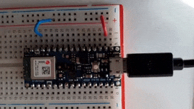

### SIMPLE BLINK EXAMPLE

Ported to Arduino 33 BLESense board (https://store.arduino.cc/arduino-nano-33-ble-sense). In order to flash code with nrfutil, Adafruit bootloader has to be flashed onto the board. Two wires need to be attached to the pads on the bottom side of the board (SWDIO and SWCLK).



* step 1: clone the repo from https://github.com/adafruit/Adafruit_nRF52_Bootloader
and build with `make BOARD=arduino_nano_33_ble all`
* step 2: flash using Black Magic Probe and GDB:
`gdb`
`target extended-remote /dev/ttyACM0`
`monitor swdp_scan`
`attach 1` (Nordic nRF52 M4)
`load arduino_nano_33_ble_bootloader-0.4.0-2-g4ba802d_s140_6.1.1.hex`
`kill`


### HOW TO FLASH:

* build the code: ```cargo build --release```
* convert to .hex file: ```arm-none-eabi-objcopy -O ihex target/thumbv7em-none-eabihf/release/blinky blinky.hex```
* create a dfu package: ```adafruit-nrfutil dfu genpkg --dev-type 0x0052 --application blinky.hex blinky.zip```
* put the board into bootloader mode (double click on reset button, will show up as _NANO33BOOT_ 
* flash the firmware: ```adafruit-nrfutil dfu serial --package blinky.zip -p /dev/ttyACM0 -b 115200```
